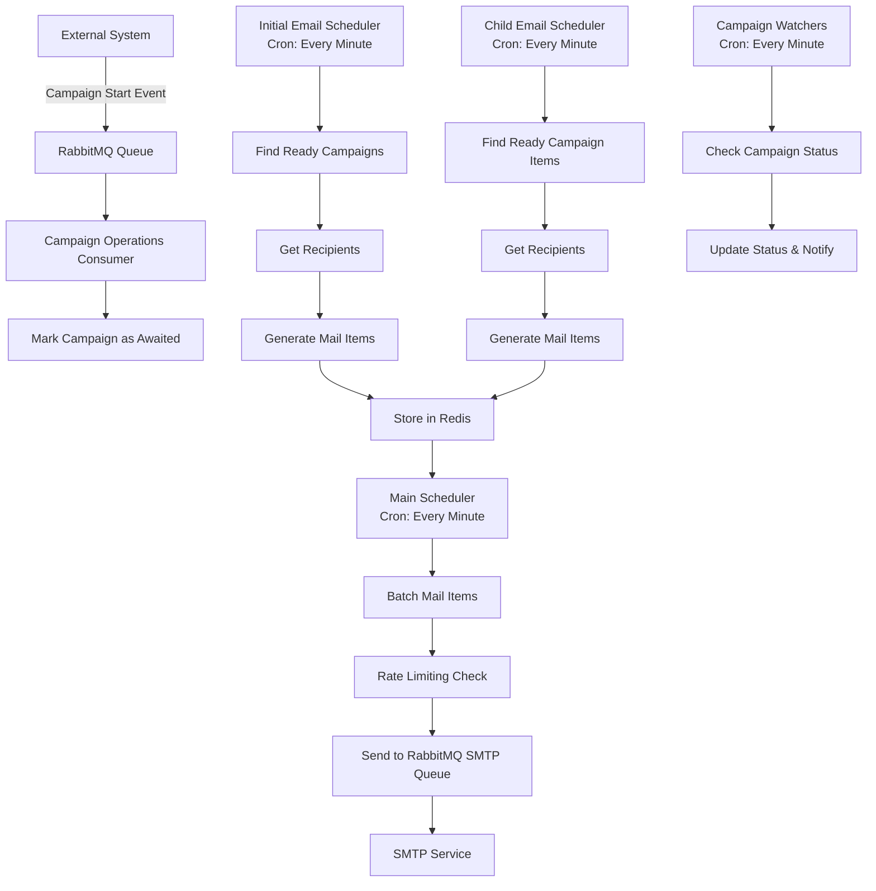
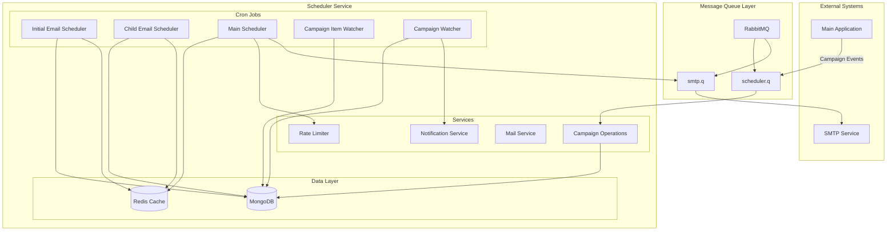
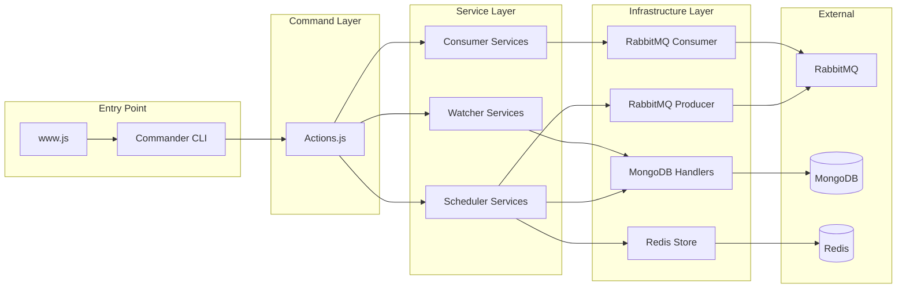
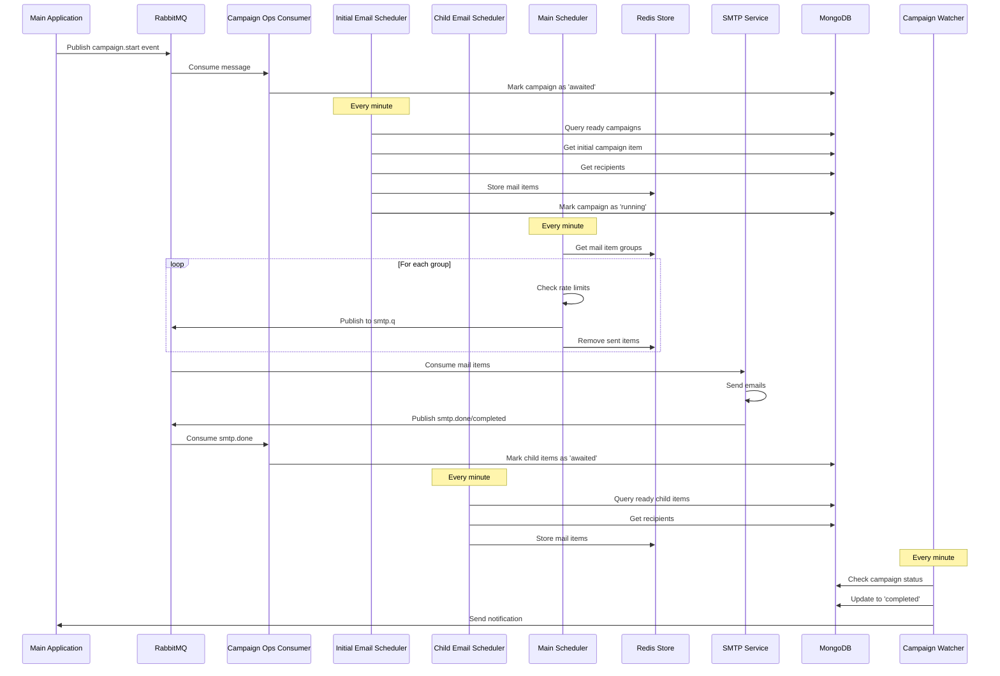
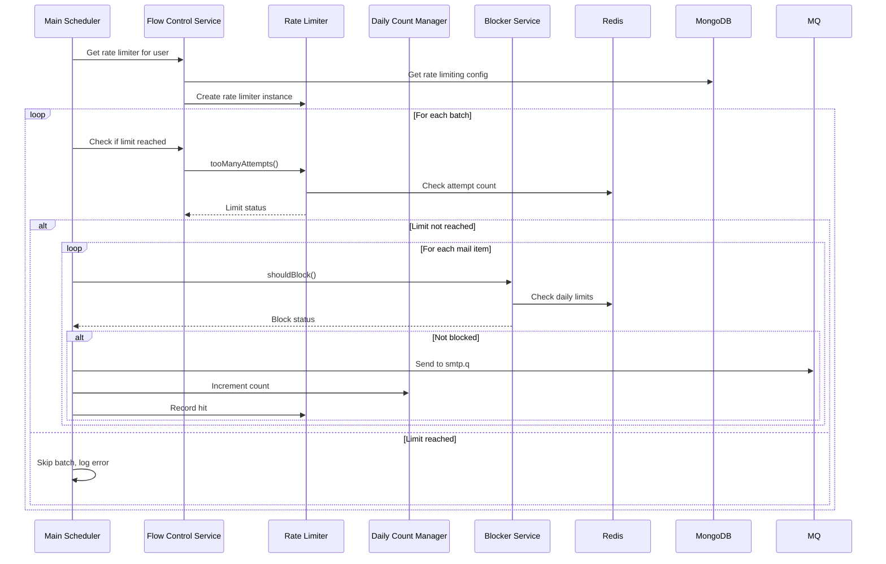

# Email Campaign Scheduler - Technical Documentation

## Executive Summary

The **Email Campaign Scheduler** is a Node.js-based microservice designed to orchestrate, schedule, and deliver email campaigns at scale. The system manages complex email sequences (drip campaigns), enforces rate limiting to prevent service provider throttling, and provides real-time campaign status monitoring. It integrates with multiple email service providers (AWS SES, SendGrid, Gmail, Office365, Custom SMTP) and uses message queues for asynchronous processing.

---

## Table of Contents

1. [System Overview](#system-overview)
2. [Architecture](#architecture)
3. [Core Components](#core-components)
4. [Data Flow](#data-flow)
5. [Technology Stack](#technology-stack)
6. [Key Features](#key-features)
7. [Deployment](#deployment)

---

## System Overview

### Purpose

The scheduler service is responsible for:
- **Campaign Scheduling**: Automatically scheduling initial and follow-up emails based on campaign configurations
- **Email Delivery**: Coordinating email sends through various SMTP providers with intelligent rate limiting
- **Campaign Lifecycle Management**: Tracking campaign and campaign item statuses (draft, awaited, running, paused, completed)
- **Rate Limiting**: Preventing email service provider throttling by enforcing per-user, per-service rate limits
- **Event-Driven Operations**: Processing campaign control operations (start, pause, delete) via message queues

### High-Level Flow



---

## Architecture

### System Architecture Diagram



### Component Architecture



---

## Core Components

### 1. Initial Email Scheduler

**Purpose**: Identifies campaigns ready to start and schedules their initial emails.

**Process**:
1. Queries MongoDB for campaigns with status `awaited` and `scheduled_at <= now`
2. For each campaign, retrieves the initial campaign item
3. Fetches recipient lists for the campaign item
4. Generates mail items (one per recipient)
5. Stores mail items in Redis, grouped by `userId|campaignId`
6. Marks campaign as `running`

**Location**: `App/Services/Scheduler/InitialEmailScheduler.js`

**Schedule**: Runs every minute via cron job

### 2. Child Email Scheduler

**Purpose**: Schedules follow-up emails (drip campaigns) based on parent email completion.

**Process**:
1. Queries MongoDB for campaign items with status `awaited` and `scheduled_at <= now`
2. Retrieves the parent campaign
3. Fetches recipient lists (filtered by previous email interactions)
4. Generates mail items
5. Stores in Redis
6. Marks campaign item as `running`

**Location**: `App/Services/Scheduler/ChildEmailScheduler.js`

**Schedule**: Runs every minute via cron job

### 3. Main Scheduler (Email Sender)

**Purpose**: Processes queued mail items and sends them via RabbitMQ.

**Process**:
1. Retrieves all mail item groups from Redis (keyed by `userId|campaignId`)
2. For each group:
   - Creates a `SendBatchService` instance
   - Batches mail items using `MailBatchHelper`
   - For each batch:
     - Checks rate limiting (per user, per email service)
     - Checks daily limits
     - Checks blocker service (additional limits)
     - Sends each mail item to RabbitMQ `smtp.q` queue
     - Removes sent items from Redis
     - Records rate limiter hits

**Location**: `App/Services/Scheduler/Scheduler.js`

**Schedule**: Runs every minute via cron job

### 4. Campaign Operations Consumer

**Purpose**: Handles campaign control operations received via RabbitMQ.

**Supported Events**:
- `campaign.start`: Marks campaign as `awaited`
- `campaign.pause`: Pauses campaign and all items
- `campaign.delete`: Deletes campaign
- `smtp.done`: Marks child items as `awaited` (triggered after parent email sent)
- `smtp.completed`: Marks campaign/campaign items as `completed`
- `smtp.rescheduled`: Removes campaign from Redis store

**Location**: `App/Services/RabbitMQ/Consumer.js`

**Queue**: `scheduler.q` (RabbitMQ)

### 5. Campaign Watchers

**Purpose**: Monitor campaign and campaign item statuses and update them accordingly.

#### Running Campaign Item Watcher
- Checks campaign items with status `running`
- If all intended recipients have been processed, marks item as `completed`
- If item has children, marks them as `awaited`

#### Running Campaign Watcher
- Checks campaigns with status `running`
- If all campaign items are `completed`, marks campaign as `completed`
- Sends notification via `NotificationService`

**Location**: 
- `App/Services/Watcher/RunningCampaignItemWatcher.js`
- `App/Services/Watcher/RunningCampaignWatcher.js`

**Schedule**: Both run every minute via cron job

### 6. Rate Limiting System

**Purpose**: Prevents email service provider throttling by enforcing rate limits.

**Components**:
- **RateLimiter**: Core rate limiting logic using Redis
- **FlowControlService**: Determines rate limits per user/email service
- **DailyCountManager**: Tracks daily email counts per user
- **BlockerService**: Additional blocking criteria
- **RateLimitingConfig**: MongoDB-stored configuration

**Rate Limiting Strategy**:
1. Per-user, per-email-service rate limits
2. Configurable batch sizes and delays
3. Daily sending limits
4. Redis-based sliding window counters

**Location**: `App/Services/RateLimiter/`

---

## Data Flow

### Complete Email Campaign Flow



### Rate Limiting Flow



---

## Technology Stack

### Core Technologies

| Technology | Version | Purpose |
|------------|---------|---------|
| **Node.js** | - | Runtime environment |
| **Express.js** | 4.17.1 | HTTP server framework |
| **MongoDB** | 3.3.0 | Primary database (campaigns, recipients, config) |
| **Mongoose** | 5.6.9 | MongoDB ODM |
| **Redis** | 2.8.0 | Caching and mail item queue storage |
| **RabbitMQ** (amqplib) | 0.5.5 | Message queue for async operations |
| **node-cron** | 2.0.3 | Scheduled job execution |

### Email Services

- **AWS SDK** (2.521.0): Amazon SES integration
- **Nodemailer** (6.3.0): SMTP client
- Supports: AWS SES, SendGrid, Gmail (OAuth), Office365, Custom SMTP

### Monitoring & Logging

- **Sentry** (@sentry/node): Error tracking
- **Bunyan** (1.8.12): Structured logging
- **LogDNA** (3.3.0): Log aggregation

### Development Tools

- **Mocha** & **Chai**: Testing framework
- **ESLint**: Code linting
- **JSDoc**: API documentation

---

## Key Features

### 1. Multi-Provider Email Support

The system supports multiple email service providers:
- **AWS SES**: Amazon Simple Email Service
- **SendGrid**: Third-party email API
- **Gmail (OAuth)**: Google OAuth-based sending
- **Office365**: Microsoft 365 integration
- **Custom SMTP**: Generic SMTP server support

Each provider has its own rate limiting configuration.

### 2. Intelligent Rate Limiting

- **Per-User Limits**: Each user has individual rate limits
- **Per-Service Limits**: Different limits for different email providers
- **Batch Processing**: Emails are sent in configurable batches
- **Daily Limits**: Maximum emails per day per user
- **Sliding Window**: Redis-based time-windowed rate limiting

### 3. Drip Campaign Support

- **Initial Emails**: First email in a sequence
- **Follow-up Emails**: Triggered by parent email completion
- **Conditional Logic**: Support for reply, open, click, no-open triggers
- **Delay Configuration**: Configurable delays between emails

### 4. Campaign Status Management

**Campaign Statuses**:
- `draft`: Campaign created but not scheduled
- `awaited`: Scheduled but not yet started
- `running`: Actively sending emails
- `paused`: Temporarily stopped
- `stopped`: Manually stopped
- `completed`: All emails sent

**Campaign Item Statuses**:
- `draft`, `awaited`, `running`, `completed`, `paused`, `stopped`, `pending`

### 5. Event-Driven Architecture

- **RabbitMQ Integration**: Asynchronous message processing
- **Event Types**: Campaign start, pause, delete, completion
- **Decoupled Services**: Scheduler service independent of main application

### 6. Scalability Features

- **Redis Queue**: In-memory mail item storage for fast processing
- **Batch Processing**: Efficient email sending in batches
- **Horizontal Scaling**: Stateless design allows multiple instances
- **Cron-Based Processing**: Predictable, scheduled execution

---

## Data Models

### Campaign Schema

```javascript
{
  title: String,
  user_id: ObjectId,
  email_id: String,
  service_type: Enum['gauth', 'custom-smtp', 'sendgrid', 'amazonses', 'office365'],
  sender_name: String,
  reply_to: String,
  drip: Number,
  team_id: ObjectId,
  recipient_groups: [ObjectId],
  stop_follow_up: Boolean,
  status: Enum['draft', 'running', 'paused', 'stopped', 'completed', 'awaited'],
  recipient_count: Number,
  scheduled_at: Date,
  access: [{ user_id: ObjectId, role: Enum['admin', 'manager'] }]
}
```

### Campaign Item Schema

```javascript
{
  campaign_id: ObjectId,
  status: Enum['draft', 'awaited', 'running', 'completed', 'paused', 'stopped', 'pending'],
  scheduled_at: Date,
  delay: Number,
  item_type: Enum['initial', 'reply', 'open', 'click', 'noopen', 'drip'],
  parent_id: ObjectId,
  emailtemplate: { value: ObjectId, label: String },
  intendedRecipients: [ObjectId],
  replied: [ObjectId],
  opened: [{ recipient_id: ObjectId, opened_at: Date }],
  clicked: [{ recipient_id: ObjectId, link: String, clicked_at: Date }],
  hasChild: Boolean,
  childElem: [ObjectId],
  node_id: String
}
```

### Mail Item Structure (Redis)

```javascript
{
  userId: String,
  team_id: String,
  service_type: String,
  sender_email_id: String,
  campaignId: String,
  campaignItemId: String,
  recipient_id: ObjectId,
  recipient_groups: [String],
  // ... recipient subscriber fields
}
```

**Redis Key Format**: `mailItem|{userId}|{campaignId}`

---

## Deployment

### Docker Support

The project includes Docker configuration:
- **Dockerfile**: Located in `ops/docker/`
- **Build Script**: `ops/docker/build.sh`

### Kubernetes/Helm

- **Helm Chart**: `ops/helm/email-scheduler/`
- **Deployment Config**: Kubernetes deployment manifests
- **RBAC Config**: Role-based access control

### Environment Variables

Key environment variables (from `Config/index.js`):
- `MONGODB_CONN_URL`: MongoDB connection string
- `REDIS_HOST`, `REDIS_PORT`: Redis configuration
- `RABBITMQ_CONN_URL`: RabbitMQ connection string
- `AWS_ACCESS_KEY`, `AWS_SECRET_KEY`: AWS SES credentials
- `MAIL_FROM`: Default sender email
- `PORT`: HTTP server port
- `LOGGING_LEVEL`, `LOG_API_KEY`: Logging configuration

### Running the Service

**Start all services**:
```bash
npm start
```

**Run individual services**:
```bash
npm run initialEmails    # Initial email scheduler
npm run childEmails      # Child email scheduler
npm run scheduler        # Main scheduler
npm run watcherCampaignItems  # Campaign item watcher
npm run watcherCampaigns      # Campaign watcher
npm run consume          # RabbitMQ consumer
```

---

## System Limitations & Considerations

### Current Limitations

1. **Cron Frequency**: All schedulers run every minute, which may not be optimal for high-volume scenarios
2. **Single-Threaded Processing**: Node.js event loop may be a bottleneck for very large batches
3. **Redis Dependency**: System requires Redis to be available; no fallback mechanism
4. **Error Handling**: Some errors are logged but processing continues, which may lead to data inconsistencies
5. **No Retry Mechanism**: Failed email sends are not automatically retried (relies on external SMTP service)

### Scalability Considerations

1. **Horizontal Scaling**: Multiple instances can run simultaneously, but Redis key management needs coordination
2. **Database Load**: Frequent MongoDB queries every minute may cause load at scale
3. **Rate Limiting**: Redis-based rate limiting is efficient but requires Redis to be highly available
4. **Message Queue**: RabbitMQ should be configured for high availability

### Security Considerations

1. **Credentials**: AWS keys and other secrets are in configuration files (should use secret management)
2. **No Authentication**: Express server has no authentication middleware
3. **Input Validation**: Limited validation on incoming RabbitMQ messages

---

## Testing

The project includes test files in the `Test/` directory:
- Unit tests for services
- Database handler tests
- Service integration tests

Run tests:
```bash
npm test
```

---

## Monitoring & Observability

1. **Sentry Integration**: Error tracking and alerting
2. **LogDNA**: Centralized logging
3. **Bunyan Logs**: Structured JSON logging
4. **Campaign Status Tracking**: Real-time status updates in MongoDB

---

## Future Enhancements (Recommendations)

1. **Retry Logic**: Implement exponential backoff for failed email sends
2. **Dead Letter Queue**: Handle permanently failed messages
3. **Metrics Collection**: Add Prometheus/metrics endpoint
4. **Health Checks**: Add health check endpoints for Kubernetes
5. **Graceful Shutdown**: Implement proper shutdown handling for cron jobs
6. **Database Indexing**: Optimize MongoDB queries with proper indexes
7. **Rate Limiting Improvements**: Add adaptive rate limiting based on provider feedback
8. **Batch Size Optimization**: Dynamic batch sizing based on system load

---

## Conclusion

The Email Campaign Scheduler is a robust, event-driven microservice designed to handle email campaign orchestration at scale. It provides intelligent rate limiting, multi-provider support, and comprehensive campaign lifecycle management. While the system is production-ready, there are opportunities for enhancement in error handling, retry mechanisms, and observability.

---

**Documentation Version**: 1.0  

